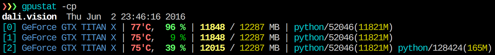

`gpustat`
=========

[][pypi_gpustat]
[](https://travis-ci.org/wookayin/gpustat)
[](LICENSE)

Just *less* than nvidia-smi?



Usage
-----

`$ gpustat`

Options:

* `--no-color`        : Suppress color (by default, color is enabled)
* `-u`, `--show-user` : Display username of the process owner
* `-c`, `--show-cmd`  : Display the process name
* `-p`, `--show-pid`  : Display PID of the process
* `--json`            : JSON Output (Experimental, #10)

### Tips

- To periodically watch, try `watch --color -n1.0 gpustat` (built-in watch support will be added soon).
- Running `nvidia-smi daemon` (root privilege required) will make the query much **faster**.
- The GPU ID (index) shown by `gpustat` (and `nvidia-smi`) is PCI BUS ID,
  while CUDA differently assigns the fastest GPU with the lowest ID by default.
  Therefore, in order to make CUDA and `gpustat` use **same GPU index**,
  configure the `CUDA_DEVICE_ORDER` environment variable to `PCI_BUS_ID`
  (before setting `CUDA_VISIBLE_DEVICES` for your CUDA program):
  `export CUDA_DEVICE_ORDER=PCI_BUS_ID`


Quick Installation
------------------

Install from [PyPI][pypi_gpustat]:

```
sudo pip install gpustat
```

To install the latest version (master branch) via pip:

```
pip install git+https://github.com/wookayin/gpustat.git@master
```

Alternatively, you can just download an *unstable* version of [gpustat.py][script_gitio] (or any [stable version][script_stable]) into somewhere in `PATH`, e.g. `~/.local/bin/`
(when you do not have root privilege, for example):

```
sudo wget https://git.io/gpustat.py -O /usr/local/bin/gpustat && sudo chmod +x /usr/local/bin/gpustat
```

[pypi_gpustat]: https://pypi.python.org/pypi/gpustat
[script_gitio]: https://git.io/gpustat.py
[script_stable]: https://raw.githubusercontent.com/wookayin/gpustat/v0.2.0/gpustat.py


License
-------

[MIT License](LICENSE)
